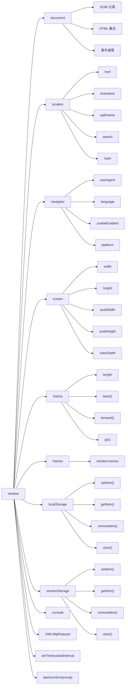

# 瀏覽器物件模型（BOM） 

###### tags: `JavaScript` `瀏覽器` `BOM`

## 定義
- **瀏覽器物件模型（Browser Object Model, BOM）** 是瀏覽器提供的一組物件和方法，讓 JavaScript 能與瀏覽器本身互動
- 它不同於 DOM（文件物件模型），DOM 處理頁面內容，而 BOM 處理瀏覽器視窗和功能，例如視窗大小、歷史紀錄、彈窗等

### 比喻
- 如果 DOM 是「網頁的藍圖」（操作頁面元素），BOM 就是「瀏覽器的遙控器」（控制視窗和瀏覽器行為）

## BOM 的核心組成



### window 物件（核心根物件）
- **角色**: BOM 的根物件，代表整個瀏覽器視窗
- **功能**: 以下所有 BOM 物件都是 window 的屬性

#### document 物件 (window.document)
- **角色**: BOM 的一部分，也是 DOM 的入口，代表頁面內容
- **功能**: 操作 HTML 元素（屬於 DOM 的核心）
- **範例**:
  ```javascript
  console.log(window.document.title) // 頁面標題
  document.body.style.background = 'lightblue' // 改變背景色
  ```

#### navigator 物件 (window.navigator)
- **角色**: 提供瀏覽器和用戶設備的資訊
- **常用屬性**:
  - `navigator.userAgent`: 瀏覽器識別字串
  - `navigator.language`: 使用者語言
  - `navigator.onLine`: 是否連線
- **範例**:
  ```javascript
  console.log(window.navigator.userAgent) // "Mozilla/5.0 ..."
  ```

#### location 物件 (window.location)
- **角色**: 控制和獲取當前頁面的 URL 資訊
- **常用屬性/方法**:
  - `location.href`: 完整 URL
  - `location.reload()`: 重新載入頁面
- **範例**:
  ```javascript
  console.log(window.location.href) // "https://example.com"
  ```

#### history 物件 (window.history)
- **角色**: 管理瀏覽器的歷史紀錄
- **常用方法**:
  - `history.back()`: 返回上一頁
  - `history.forward()`: 前進到下一頁
- **範例**:
  ```javascript
  window.history.back() // 等於按瀏覽器返回鍵
  ```

#### screen 物件 (window.screen)
- **角色**: 提供用戶螢幕的資訊
- **常用屬性**:
  - `screen.width`: 螢幕寬度
  - `screen.height`: 螢幕高度
- **範例**:
  ```javascript
  console.log(window.screen.width) // 例如 1920
  ```

#### localStorage/sessionStorage (window.localStorage)
- **角色**: 用於客戶端存儲數據
- **常用方法**:
  - `setItem(key, value)`: 存儲數據
  - `getItem(key)`: 獲取數據
- **範例**:
  ```javascript
  window.localStorage.setItem('username', 'John')
  ```

#### console 物件 (window.console)
- **角色**: 提供與瀏覽器控制台交互的方法
- **常用方法**:
  - `console.log()`: 記錄信息
- **範例**:
  ```javascript
  window.console.log('一般信息')
  ```

#### 原生方法 (window 直接提供)
- **setTimeout/setInterval**: 計時器函數
- **alert/confirm/prompt**: 對話框函數
- **範例**:
  ```javascript
  window.setTimeout(() => console.log('延遲執行'), 1000)
  window.alert('警告訊息')
  ```

#### XMLHttpRequest (通過 window 創建)
- **角色**: 用於與伺服器交換數據（AJAX 的基礎）
- **範例**:
  ```javascript
  const xhr = new window.XMLHttpRequest()
  ```

## BOM 與 DOM 的區別

| 特性 | BOM | DOM |
|------|-----|-----|
| **範圍** | 瀏覽器視窗和功能 | 頁面內容和結構 |
| **根物件** | window | document (window.document) |
| **標準化** | 較少標準化 | W3C 標準規範 |

## 實際應用

### 範例: 視窗大小監控
```javascript
window.addEventListener('resize', () => {
  console.log(`寬: ${window.innerWidth}, 高: ${window.innerHeight}`)
})
```

### 範例: 確認離開頁面
```javascript
window.addEventListener('beforeunload', (event) => {
  event.preventDefault()
  event.returnValue = '確定要離開嗎？' // 顯示提示
})
```

### 範例: 檢查瀏覽器資訊
```javascript
if (navigator.userAgent.includes('Chrome')) {
  console.log('你在用 Chrome')
}
```

## 注意事項
- **標準化程度**: BOM 沒有像 DOM 那樣統一的 W3C 標準，有些功能因瀏覽器而異
- **相容性**: 檢查 `navigator.userAgent` 或特性檢測確保功能可用

## 總結
- **階層結構**: window 物件是 BOM 的頂層物件，其他所有 BOM 物件都是它的子物件
- **存取方式**: 雖然可以直接使用 `document`、`navigator` 等，但它們實際上是 `window.document`、`window.navigator` 的簡寫
- **全局範圍**: window 物件同時也是全局對象，全局變量和函數都是它的屬性